This is a Kotlin Multiplatform project targeting Android, iOS, Web, Desktop (JVM).

## 📦 Monorepo Structure

This repository is organized as a monorepo containing multiple KMP applications that share common UI components:

- **`composeApp`**: Main Puzzroom application for room layout planning
- **`nlt-app`**: NLT (Notification & Location Tracker) application for tracking notifications with location
- **`quick-deploy-app`**: Quick Deploy tool for streamlined deployment in the Puzzroom ecosystem
- **`shared-ui`**: Shared UI components library (atoms, molecules, organisms, theme)

All applications follow the **Atomic Design** methodology and share the same warm color theme.

## 🎨 UI Architecture - Atomic Design

This project implements the **Atomic Design** methodology for UI components, providing a scalable and maintainable component hierarchy with a warm color theme.

### Component Structure

The UI is organized in a strict hierarchy - always follow this when creating or modifying components:

- **Atoms** (`ui/atoms/` - 5 components): Basic UI elements that cannot be broken down further
  - `AppButton`, `AppText`, `AppIcon`, `AppSpacer`, `AppCard`
  - **Rule**: Generic, reusable, no business logic
  
- **Molecules** (`ui/molecules/` - 5 components): Simple combinations of 2-3 atoms
  - `IconWithLabel`, `TitleWithSubtitle`, `ImageWithFallback`, `ConfirmationDialog`, `SaveStateIndicator`
  - **Rule**: Single purpose, minimal logic
  
- **Organisms** (`ui/organisms/` - 9 components): Complex sections combining molecules and atoms
  - `ProjectCardItem`, `EmptyState`, `ErrorDisplay`, `LoadingIndicator`, `ProjectList`, etc.
  - **Rule**: Feature-specific, can contain logic
  
- **Templates** (`ui/templates/` - 2 templates): Page layout structures without data
  - `ListScreenTemplate`, `EditorScreenTemplate`
  - **Rule**: Define layout only, receive content via parameters
  
- **Pages** (`ui/pages/` - 2+ pages): Complete pages with ViewModel integration
  - `ProjectListPage`, `RoomEditorPage`
  - **Rule**: Integrate state management and compose templates

### Data Flow Pattern

- **State Down**: ViewModel → Pages → Templates → Organisms → Molecules → Atoms
- **Events Up**: User interactions flow back through callbacks to ViewModel

### Theme

The app uses a **warm color palette** designed for a calm, comfortable user experience:
- Primary: Warm terracotta (#D4856A)
- Secondary: Soft peach (#E8B4A0)
- Tertiary: Warm beige (#E5D4C1)
- Background: Warm white (#FAF4F0)

**Always use theme colors** via `MaterialTheme.colorScheme` - never hardcode colors.

### Creating New Components

**Step 1**: Determine the correct level based on complexity:
- Single element? → Create/use an Atom
- Combining 2-3 atoms? → Create a Molecule
- Multiple molecules? → Create an Organism
- Full page layout? → Create a Template
- Needs data/ViewModel? → Create a Page

**Step 2**: Place in correct directory:
```kotlin
ui/atoms/AppButton.kt           // Atoms: App[Element].kt
ui/molecules/IconWithLabel.kt   // Molecules: [Descriptive][Purpose].kt
ui/organisms/ProjectCardItem.kt // Organisms: [Feature][Component].kt
ui/templates/ListTemplate.kt    // Templates: [Purpose]Template.kt
ui/pages/ProjectListPage.kt     // Pages: [Feature]Page.kt
```

**Step 3**: Follow composition pattern - compose upward through hierarchy:
```
Atoms → Molecules → Organisms → Templates → Pages
```

### Documentation

- [**GitHub Copilot Instructions**](./.github/copilot-instructions.md) - **Read this for AI-assisted development**
- [Atomic Design Guide](./composeApp/docs/design/AtomicDesignGuide.md) - Detailed implementation guide (Japanese)
- [UI Structure README](./composeApp/src/commonMain/kotlin/tokyo/isseikuzumaki/puzzroom/ui/README.md) - Overview (English)
- [Architecture Diagrams](./composeApp/docs/design/AtomicDesignArchitecture.md) - Visual architecture
- [Migration Examples](./composeApp/docs/design/ComponentMigrationExamples.md) - How to migrate existing components
- [Implementation Summary](./composeApp/docs/design/AtomicDesignImplementationSummary.md) - Complete summary

---

## 機能開発の進化ツリー

この図は、「誰の（Actor）」「どんな目的を（Goal）」達成するためにプロダクトが進化していくのかを、Gitのブランチモデルで表現したものです。各マイルストーンに付けられたタグによって、それぞれの開発フェーズが提供する具体的なユーザー価値が明確になっています。

```mermaid
gitGraph
    commit id: "プロジェクト開始"
    commit id: "コア機能の基盤構築"
    commit id: "部屋作成機能"
    commit id: "家具の作成・管理機能"
    commit id: "家具の配置・調整機能"
    commit id: "2Dビュー & 干渉チェック"
    commit id: "Phase 1: MVP 完成" tag: "引越しする人: 失敗なく配置を計画したい" type: HIGHLIGHT

    branch develop
    checkout develop
    commit id: "アカウント機能"
    commit id: "クラウド同期機能"
    commit id: "共有URL発行機能" tag: "共有したい人: プランを共有しどこでも見たい"

    branch usecase/for-professionals
    checkout usecase/for-professionals
    commit id: "プリセット家具機能"
    commit id: "ARプレビュー機能" tag: "不動産業者: 顧客への提案力を強化したい"

    checkout develop
    branch usecase/collaboration
    checkout usecase/collaboration
    commit id: "リアルタイム共同編集機能" tag: "カップル・家族: 一緒にレイアウトを決めたい"

    checkout develop
    branch usecase/advanced-simulation
    checkout usecase/advanced-simulation
    commit id: "生活動線の可視化機能"
    commit id: "日当たりシミュレーション機能" tag: "暮らしの質を高めたい人: 動線や日当たりまで考慮し、最も快適な空間を作りたい"
```



### この図の見方

- **ブランチ (Branch)**: 特定のユースケースを実現するための開発ラインを示します。（例: `usecase/for-professionals`）
- **コミット (Commit)**: ユースケースを実現するために開発される具体的な機能を表します。（例: プリセット家具機能）
- **タグ (Tag)**: 一連の機能が完成したときに達成される、「誰の (Actor) どんな目的 (Goal)」かを示します。（例: 不動産業者: 顧客への提案力を強化したい）

この進化ツリーは、開発の段階的な進行とそれぞれのフェーズで達成されるユーザー価値を視覚的に表現しており、プロダクトロードマップの策定や、ステークホルダーへの説明に活用できます。

詳細なユースケース分析については、[Use Case Analysis](./composeApp/docs/design/UseCaseAnalysis.md) ドキュメントを参照してください。

---

## Project Structure

* [/composeApp](./composeApp/src) is for code that will be shared across your Compose Multiplatform applications.
  It contains several subfolders:
  - [commonMain](./composeApp/src/commonMain/kotlin) is for code that’s common for all targets.
  - Other folders are for Kotlin code that will be compiled for only the platform indicated in the folder name.
    For example, if you want to use Apple’s CoreCrypto for the iOS part of your Kotlin app,
    the [iosMain](./composeApp/src/iosMain/kotlin) folder would be the right place for such calls.
    Similarly, if you want to edit the Desktop (JVM) specific part, the [jvmMain](./composeApp/src/jvmMain/kotlin)
    folder is the appropriate location.

* [/iosApp](./iosApp/iosApp) contains iOS applications. Even if you’re sharing your UI with Compose Multiplatform,
  you need this entry point for your iOS app. This is also where you should add SwiftUI code for your project.

### Build and Run Android Application

To build and run the development version of the Android app, use the run configuration from the run widget
in your IDE’s toolbar or build it directly from the terminal:
- on macOS/Linux
  ```shell
  ./gradlew :composeApp:assembleDebug
  ```
- on Windows
  ```shell
  .\gradlew.bat :composeApp:assembleDebug
  ```

### Build and Run Desktop (JVM) Application

To build and run the development version of the desktop app, use the run configuration from the run widget
in your IDE’s toolbar or run it directly from the terminal:
- on macOS/Linux
  ```shell
  ./gradlew :composeApp:run
  ```
- on Windows
  ```shell
  .\gradlew.bat :composeApp:run
  ```

### Build and Run Web Application

To build and run the development version of the web app, use the run configuration from the run widget
in your IDE's toolbar or run it directly from the terminal:
- for the Wasm target (faster, modern browsers):
  - on macOS/Linux
    ```shell
    ./gradlew :composeApp:wasmJsBrowserDevelopmentRun
    ```
  - on Windows
    ```shell
    .\gradlew.bat :composeApp:wasmJsBrowserDevelopmentRun
    ```
- for the JS target (slower, supports older browsers):
  - on macOS/Linux
    ```shell
    ./gradlew :composeApp:jsBrowserDevelopmentRun
    ```
  - on Windows
    ```shell
    .\gradlew.bat :composeApp:jsBrowserDevelopmentRun
    ```

### Build and Run iOS Application

To build and run the development version of the iOS app, use the run configuration from the run widget
in your IDE’s toolbar or open the [/iosApp](./iosApp) directory in Xcode and run it from there.

---

Learn more about [Kotlin Multiplatform](https://www.jetbrains.com/help/kotlin-multiplatform-dev/get-started.html),
[Compose Multiplatform](https://github.com/JetBrains/compose-multiplatform/#compose-multiplatform),
[Kotlin/Wasm](https://kotl.in/wasm/)…

We would appreciate your feedback on Compose/Web and Kotlin/Wasm in the public Slack channel [#compose-web](https://slack-chats.kotlinlang.org/c/compose-web).
If you face any issues, please report them on [YouTrack](https://youtrack.jetbrains.com/newIssue?project=CMP).