# 通信シーケンス図

このドキュメントは、Puzzroomアプリケーションにおけるサーバー、システム、クライアントデバイス間の通信内容を示すシーケンス図を提供します。

## 目次

1. [概要](#概要)
2. [アーキテクチャの段階的進化](#アーキテクチャの段階的進化)
3. [Phase 1: ローカルのみ（現在の実装）](#phase-1-ローカルのみ現在の実装)
4. [Phase 2-4: クラウド同期](#phase-2-4-クラウド同期)
5. [Phase 5: リアルタイム共同編集](#phase-5-リアルタイム共同編集)
6. [補足図](#補足図)

## 概要

Puzzroomアプリケーションは、段階的にアーキテクチャを進化させる設計となっています。このドキュメントでは、各フェーズにおけるコンポーネント間の通信パターンをシーケンス図で示します。

### システムコンポーネント

- **クライアントデバイス**: Android、iOS、Web、Desktop上で動作するPuzzroomアプリケーション
- **アプリケーション層**: UI、ViewModel、UseCase
- **データ層**: Repository、DataSource、Storage
- **バックエンドサーバー**: Firebase/Supabaseまたはカスタムバックエンド（Phase 3以降）
- **データベース**: Firestore/PostgreSQL（Phase 3以降）

## アーキテクチャの段階的進化

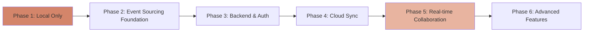

## Phase 1: ローカルのみ（現在の実装）

### 1.1 プロジェクト一覧読み込み

ユーザーがアプリを起動し、プロジェクト一覧を表示する際のシーケンス。

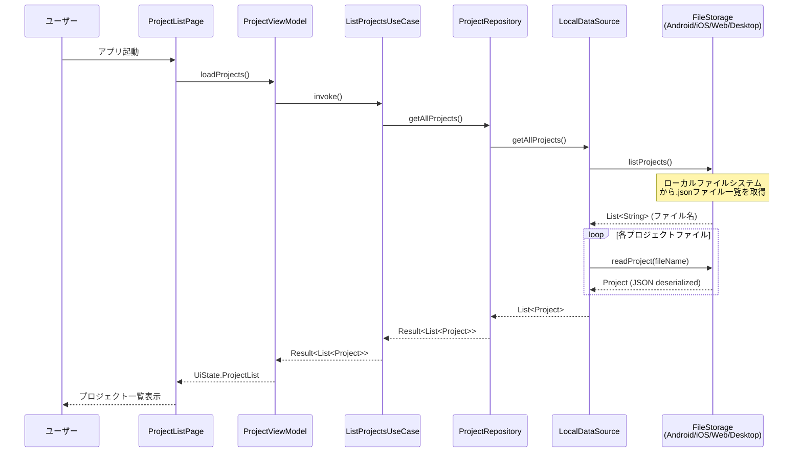

**特徴:**
- すべての処理がローカルで完結
- サーバー通信なし
- 各プラットフォームでFileStorageの実装が異なる（expect/actual）

### 1.2 プロジェクトの作成と自動保存

ユーザーが新しいプロジェクトを作成し、編集する際のシーケンス。

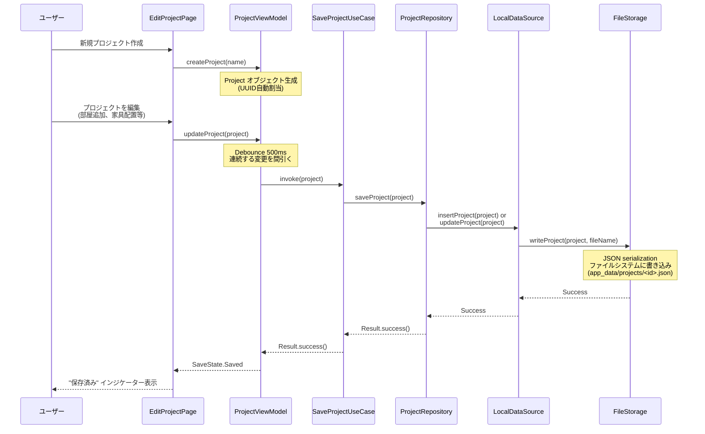

**特徴:**
- 自動保存（Debounce 500ms）
- kotlinx.serializationによるJSON変換
- プラットフォーム固有のファイルシステムAPI使用

### 1.3 プロジェクトの読み込みと編集

既存プロジェクトを開いて編集する際のシーケンス。

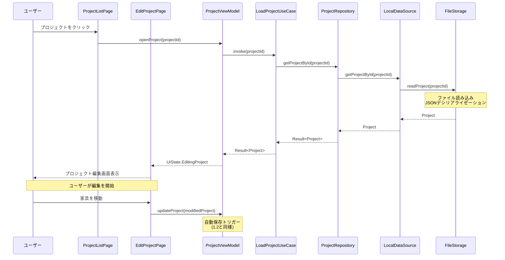

### 1.4 プロジェクトの削除

プロジェクトを削除する際のシーケンス。

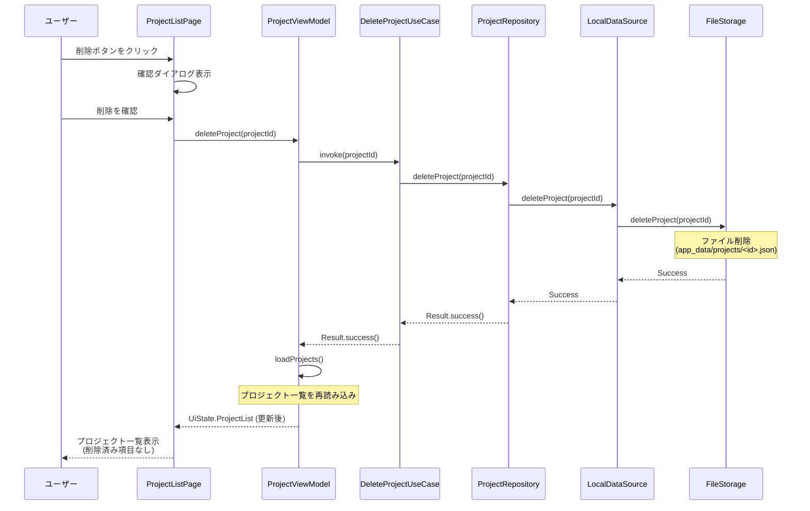

## Phase 2-4: クラウド同期

Phase 3でバックエンドと認証を導入し、Phase 4で複数デバイス間の同期を実現します。

### 2.1 ユーザー認証

アプリ起動時の認証フロー。

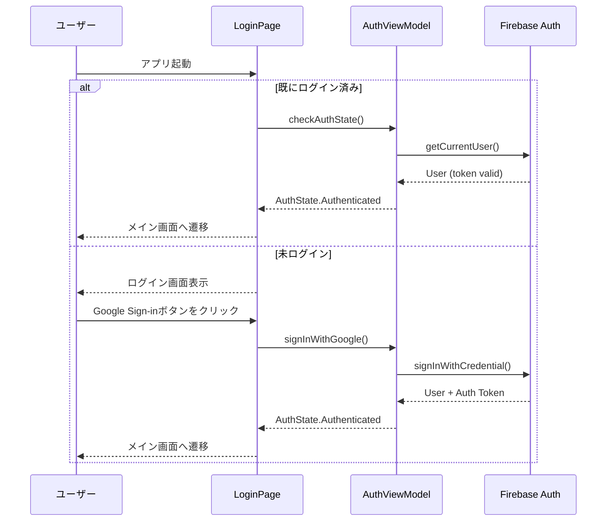

### 2.2 プロジェクト一覧の同期（クラウドからの読み込み）

認証後、クラウドからプロジェクト一覧を同期する。

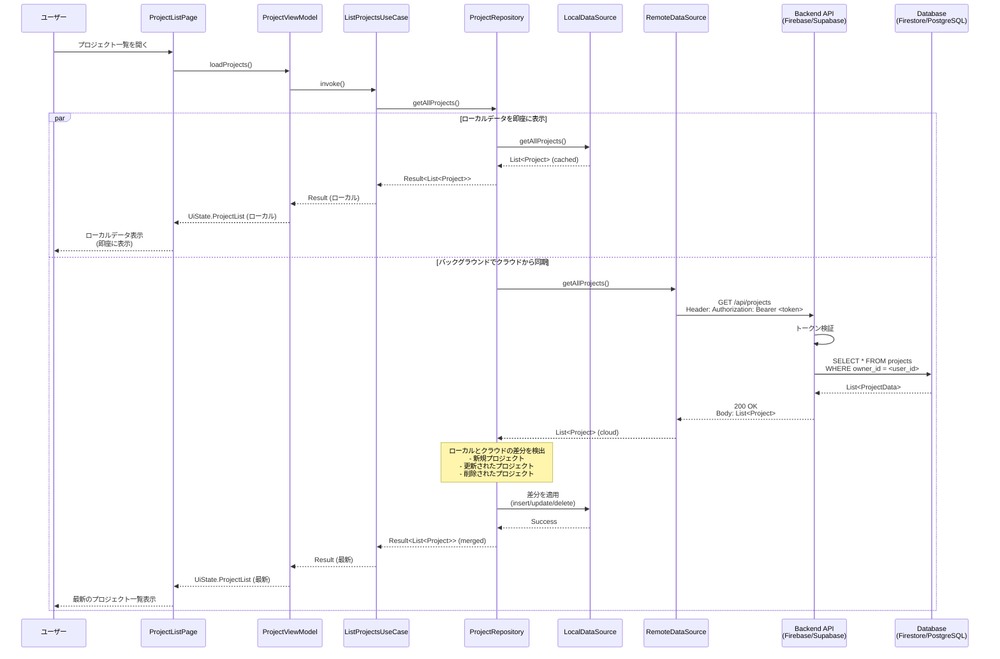

**特徴:**
- **Local-first**: まずローカルデータを表示し、UX向上
- **バックグラウンド同期**: クラウドから最新データを取得
- **認証トークン**: すべてのAPI呼び出しにBearerトークンを含める

### 2.3 プロジェクトの作成とクラウドへの同期

新規プロジェクトを作成し、クラウドに同期する。

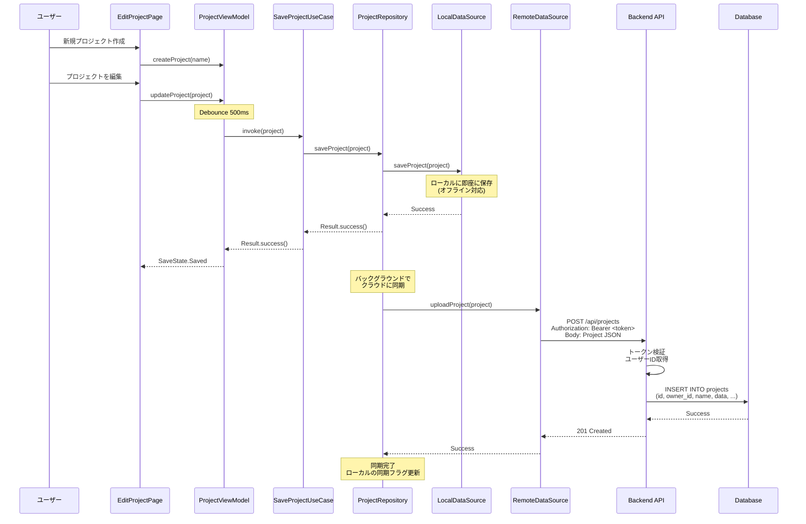

**特徴:**
- **即座にローカル保存**: オフラインでも動作
- **バックグラウンド同期**: ネットワークが利用可能になったら自動的にアップロード
- **Optimistic UI**: UIは保存完了を即座に反映

### 2.4 競合解決（単一ユーザー・複数デバイス）

同じユーザーが複数デバイスで編集した場合の競合解決。

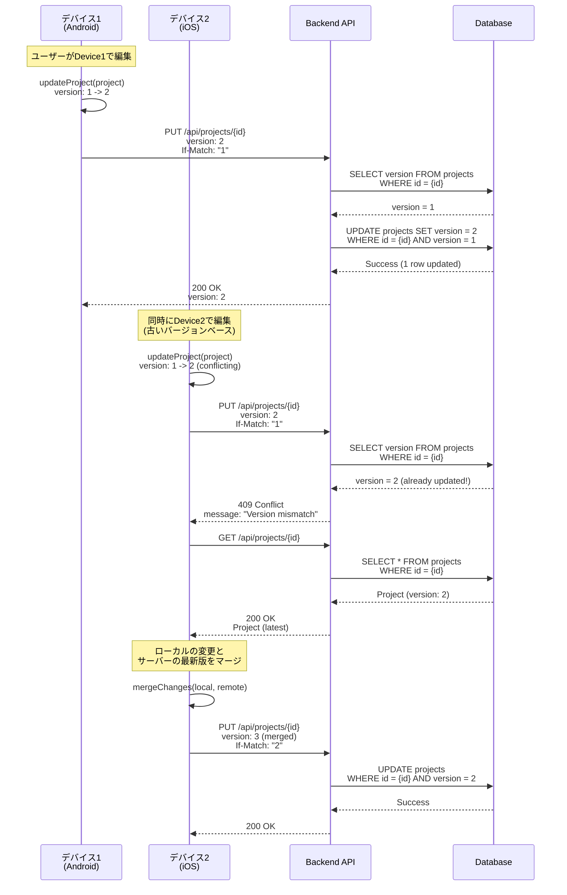

**特徴:**
- **楽観的ロック**: versionフィールドでバージョン管理
- **If-Match ヘッダー**: 競合検出
- **マージ戦略**: Last-Write-Wins または ユーザーによる手動マージ

## Phase 5: リアルタイム共同編集

複数ユーザーが同時に同じプロジェクトを編集できるリアルタイム共同編集。

### 3.1 WebSocket接続の確立

プロジェクトを開いた際にWebSocket接続を確立する。

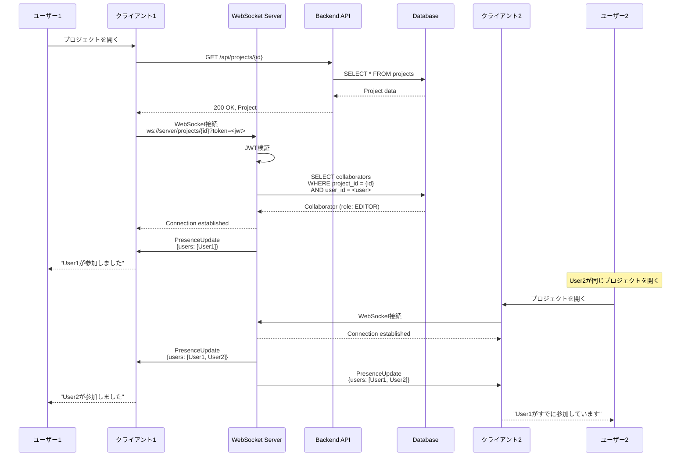

**特徴:**
- **JWT認証**: WebSocket接続時にトークン検証
- **Presence通知**: 誰がオンラインかをリアルタイムで共有
- **プロジェクトごとのチャンネル**: 各プロジェクトで独立したWebSocketチャンネル

### 3.2 リアルタイム編集 - Entity Locking方式

推奨方式：同一エンティティを同時編集できるのは1人のみ。

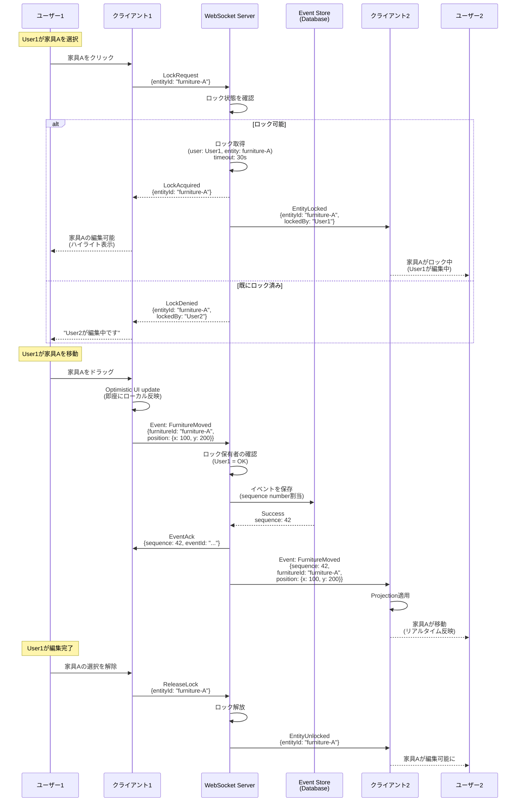

**特徴:**
- **Entity Locking**: 同一エンティティへの同時編集を防止
- **Optimistic UI**: ローカルで即座に反映、サーバー確認は非同期
- **自動タイムアウト**: 30秒後にロック自動解放（接続断絶時の対策）
- **Event Sourcing**: すべての変更をイベントとして記録

### 3.3 リアルタイム編集 - カーソル位置共有

他のユーザーのカーソル位置をリアルタイムで表示。

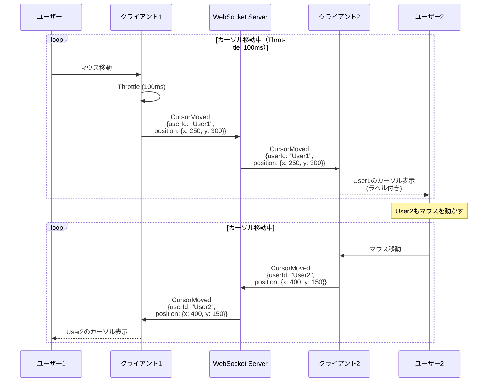

**特徴:**
- **Throttle**: 100msごとに送信（帯域幅節約）
- **ユーザー識別**: カーソルごとに色・ラベル表示
- **低遅延**: WebSocketによる双方向通信

### 3.4 接続断絶とリカバリー

ネットワーク切断時のリカバリー処理。

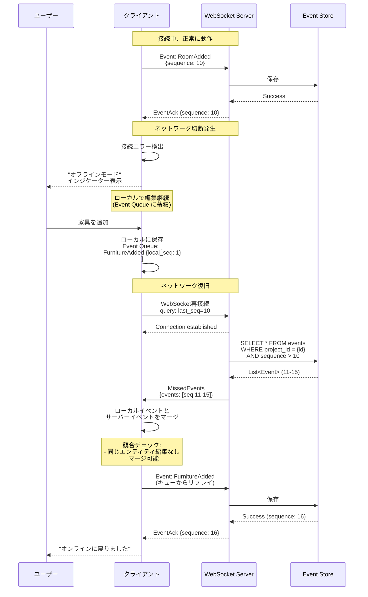

**特徴:**
- **自動再接続**: 指数バックオフで再接続試行
- **Event Queue**: オフライン中のイベントをローカルに保持
- **Catch-up**: 再接続時、欠落したイベントを取得
- **Conflict Detection**: マージ時に競合を検出

### 3.5 複数ユーザーの同時編集（成功ケース）

異なるエンティティを編集する場合、問題なく同時編集可能。

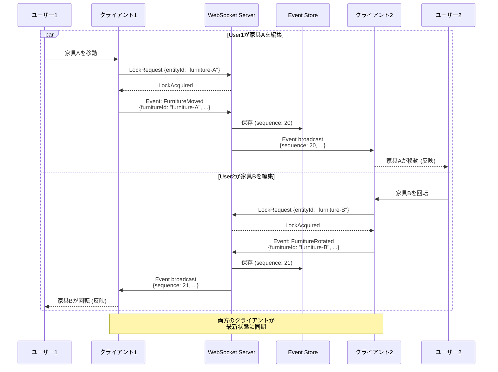

**特徴:**
- **並列編集**: 異なるエンティティなら同時編集可能
- **イベント順序保証**: Sequence numberで順序を保証
- **即座の反映**: Optimistic UI + サーバー確認

## 補足図

### システムアーキテクチャ全体図

各フェーズでのアーキテクチャの進化を示します。

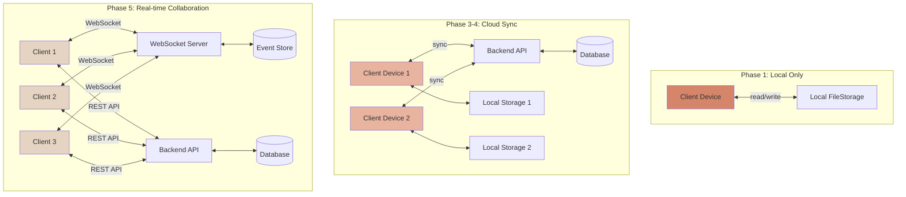

### データフロー図（Phase 5）

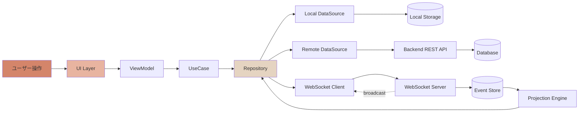

### Event Sourcingのデータフロー

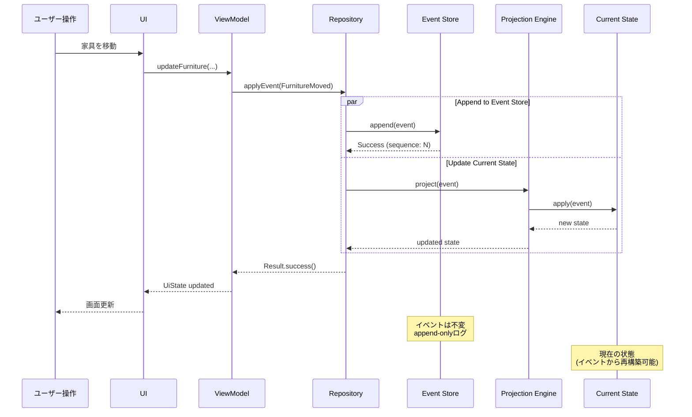

## まとめ

### 各フェーズの特徴比較

| フェーズ | 通信方式 | データストレージ | 同期 | 共同編集 |
|---------|---------|---------------|-----|---------|
| **Phase 1** | なし（ローカルのみ） | Local FileStorage | なし | 不可 |
| **Phase 2** | イベントベースの設計のみ | Local + Event Store | なし | 不可 |
| **Phase 3-4** | REST API (HTTPS) | Local + Cloud (Firestore/PostgreSQL) | バックグラウンド同期 | 単一ユーザーのみ |
| **Phase 5** | WebSocket (WSS) + REST API | Local + Cloud + Event Store | リアルタイム | 複数ユーザー可能 |

### 技術スタック

- **Phase 1**: kotlinx.serialization, expect/actual FileStorage
- **Phase 2**: Event Sourcing設計、SQLDelight (Event Store)
- **Phase 3-4**: Firebase Auth, Firestore/Supabase, Ktor Client
- **Phase 5**: WebSocket (Ktor/Firebase Realtime), Entity Locking

### セキュリティ

すべてのフェーズで以下を考慮：
- **Phase 3以降**: JWT認証、HTTPS/WSS暗号化通信
- **Authorization**: ユーザーごとのプロジェクトアクセス制御
- **Event Validation**: サーバー側でイベントの妥当性検証
- **Rate Limiting**: API呼び出し制限

## 参考資料

- [Data Persistence Design](./DataPersistence.md) - 詳細な永続化設計
- [Use Case Analysis](./UseCaseAnalysis.md) - ユースケース分析
- [Atomic Design Architecture](./AtomicDesignArchitecture.md) - UI設計

---

**ドキュメントバージョン**: 1.0  
**最終更新日**: 2025-11-02
