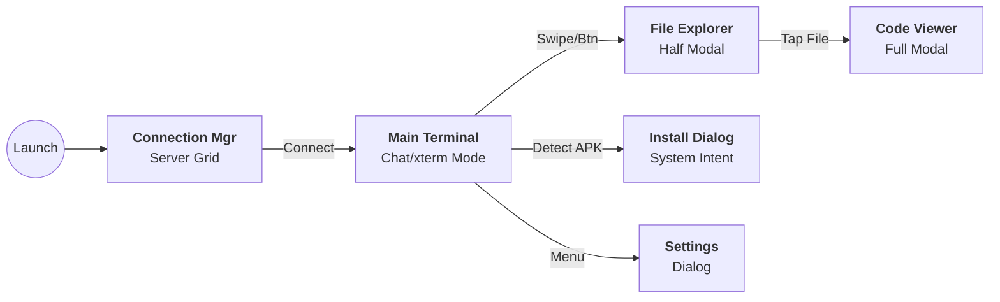

# 📱 Mobile Vibe Terminal - Master Design Document

**Project Name:** Mobile Vibe Terminal (Code Name: `mobile-vibe`)
**Version:** 2.4.0 (Security & Compatibility Update)
**Date:** 2025-12-21
**Target Platform:** Android (Primary), Desktop/JVM (Secondary), **iOS (Future)**
**Language:** Kotlin (Kotlin Multiplatform)

## 1. プロジェクト概要 (Executive Summary)

### 1.1 コンセプト: "Vertical Vibe Coding"

スマートフォン（縦画面）での開発体験を再定義する、AI時代のSSHクライアント。
Claude Code 等の **Agentic AI** をバックエンドで動かすことを前提とし、フロントエンドは「AIへの指示(Chat)」「コード確認(View)」「動作検証(Deploy)」を、**アプリを切り替えることなくシームレスに完結させる**ことを目的とする。

### 1.2 解決する課題 (Core Problems & Solutions)

| 課題領域 | 現状の課題 | Mobile Vibe Terminal の解決策 |
| --- | --- | --- |
| **Input** | ターミナルでの1文字ずつの入力やコピペ作業が苦痛。 | **Hybrid Input UI**: Gboardのバッファ入力と、制御キーの即時送信を組み合わせた入力システム。 |
| **Review** | コード確認のためにVimを開いたりアプリを切り替えると文脈が切れる。 | **Code Peek Overlay**: SSH経由でファイルを裏読みし、モーダルでサッと確認できるビューアを搭載。 |
| **Deploy** | APK転送のためにクラウドやFCMアプリを経由し、AIに余計な指示が必要。 | **Magic Trigger Deploy**: ビルド完了ログを検知し、SFTPで直接APKをDL＆インストールする機能を統合。 |
| **Persistence** | バックグラウンドに行くと接続が切れる。 | **Keep-Alive Service**: フォアグラウンドサービスによる接続維持と、セキュアな自動再接続。 |

---

## 2. システムアーキテクチャ (Technical Architecture)

Kotlin Multiplatform (KMP) を採用。共通ロジックを最大化しつつ、プラットフォーム固有機能（SSH実装、セキュリティ、サービス）を抽象化して扱う。

### 2.1 技術スタック (Tech Stack)

| レイヤー | 技術/ライブラリ | 選定理由 |
| --- | --- | --- |
| **Language** | **Kotlin 2.0+** | K2コンパイラによる高速ビルドと安全性。 |
| **UI Framework** | **Compose Multiplatform** | Android/Desktop/iOSでUIコードを共有。 |
| **Navigation** | **Voyager** | KMP標準のナビゲーション。ScreenModelによるMVVMを実現。 |
| **DI** | **Koin** | アノテーション不要、DSLベースでKMP設定が容易。 |
| **Database** | **Room (KMP)** | SQLiteの抽象化。サーバー設定の永続化に使用。 |
| **Persistence** | **DataStore** | `SharedPreferences` のモダンな代替。設定保存用。 |
| **Security** | **Android Keystore** | 暗号鍵のハードウェア管理。認証情報の保護に使用。 |
| **SSH Core** | **Apache MINA** (Android/JVM) | 非同期処理に強く、xterm準拠の実装が可能。 |

### 2.2 モジュール構成図

```mermaid
graph TD
    subgraph "Shared (commonMain)"
        UI[<b>UI Layer</b><br>Compose Screens<br>Voyager Nav]
        VM[<b>ScreenModel</b><br>ViewModel Logic]
        Domain[<b>Domain Layer</b><br>Interfaces (SshRepo)<br>DeployUseCase]
        Data[<b>Data Layer</b><br>Room DB<br>DataStore]
    end

    subgraph "Android (androidMain)"
        Mina[<b>Apache MINA SSHD</b>]
        InstallerA[<b>Package Installer</b>]
        Service[<b>Foreground Service</b><br>Connection Keep-Alive]
        KeyStore[<b>Android Keystore</b><br>Credential Encryption]
    end

    UI --> VM
    VM --> Domain
    Domain --> Data
    Domain -.-> Mina
    Domain -.-> Service
    Data -.-> KeyStore

```

---

## 3. UI/UX デザイン仕様 (Design Specifications)

**テーマ:** "Neon Focus" - 黒背景 (`#0D1117`) にネオングリーン (`#39D353`) とソフトレッド (`#FF7B72`) のアクセント。

### 3.1 画面遷移フロー



### 3.2 詳細要件

#### A. Main Terminal (Core Experience)

* **Display Modes:** 以下の2モードを動的に切り替える。
1. **Chat Mode (Default):** `LazyColumn` ベース。過去の履歴を閲覧可能。Claude Code の出力に適している。
2. **xterm Mode (Application Mode):** `Canvas` または固定Textベース。`byobu`, `vim`, `tmux` が "Alternate Screen Buffer" を要求した際に切り替わる。全画面描画。


* **Hybrid Input System:**
* **Buffer Field:** 通常の文字入力用。
* **Direct Keys:** `TAB`, `CTRL`, `ESC`, `Arrow Keys` はバッファを経由せず即時送信。


* **Macro Row:** キーボード上部に `ESC`, `TAB`, `CTRL+C`, `|`, `->` 等を配置。

#### B. File Explorer & Viewer

* **Explorer:** `ModalBottomSheet`。パンくずリスト（Breadcrumbs）。
* **Smart Initial Path:** デフォルトはホームディレクトリ(`~`)。可能であればターミナルの `pwd` に同期。

#### C. Connection Manager

* グリッドレイアウトのカード表示。
* パスワード/鍵パスフレーズは `******` で表示（内部的には暗号化保存）。

---

## 4. 機能詳細 (Logic Specification)

### 4.1 SSH通信 & エミュレーション

* **Session Persistence:**
* Androidの **Foreground Service** を使用し、アプリがバックグラウンドに回ってもSSHセッションを切断しない（通知領域に常駐）。
* ネットワーク切断時の自動再接続ロジック。


* **xterm-256color Compliance:**
* 接続時に環境変数 `TERM=xterm-256color` を送信。
* Alternate Screen Buffer シーケンス (`\e[?1049h`) 対応。
* Window Resize Signal (`SIGWINCH`) 対応。


### 4.2 Security (Credential Storage)

* **Encryption Strategy:**
* 生のパスワードをDataStoreやDBに保存しない。
* **Android Keystore** で `AES/GCM/NoPadding` の鍵ペアを生成・管理。
* 認証情報は暗号化されたバイト列として **DataStore** に保存する。
* `EncryptedSharedPreferences` は使用しない。


### 4.3 Native Quick Deploy

* **Logic:** ログ `>> VIBE_DEPLOY: (path)` を監視 → SFTPダウンロード → `PackageInstaller` 起動。
* **Permissions:** `REQUEST_INSTALL_PACKAGES` および `POST_NOTIFICATIONS` (Android 13+)。

---

## 5. データベース設計 (Room)

**Table: `server_connections**`

| Column | Type | Note |
| --- | --- | --- |
| `id` | Long (PK) | Auto Increment |
| `alias` | String | 表示名 |
| `host` | String | IP / Domain |
| `port` | Int | Default: 22 |
| `username` | String | User |
| `auth_method` | Enum | PASSWORD / KEY_PAIR |
| `key_alias` | String? | Keystore内の鍵エイリアス（パスワード保存用） |
| `key_path` | String? | 秘密鍵ファイルのパス |
| `deploy_pattern` | String? | 監視ログパターン |

---

## 6. 実装ロードマップ (Roadmap)

### Phase 4: Explorer & Polish (完成度向上) ✅ COMPLETE

* [x] File Explorer / Code Viewer の実装。
* [x] Connection Manager (DB連携) の実装。
* [x] **Tech Fix:** SFTP用独立セッションの実装。
* [x] **Tech Fix:** SFTP操作のIOスレッド化。

### Phase 5: Essential Power-Ups (コア体験の完成) 🔥 PRIORITY

*最優先フェーズ。PO要望の `byobu` 対応と、日常使いのブロッカー（切断、入力ストレス）を解消する。*

* **Terminal Core:**
* [ ] **xterm-256color Compliance:**
* Alternate Screen Buffer 対応 (`byobu`/`vim` 表示用)。
* Canvasベースのレンダラー実装（xtermモード用）。
* Window Resize シグナル送信。


* [ ] **Background Persistence:** Foreground Service 実装。
* [ ] **Auto Session Restore:** アプリ終了・再起動時の自動接続復帰機能。
  * ViewModel保持による画面回転時のセッション維持。
  * 最後に使用したConnectionProfileを記憶し、アプリ再起動時に自動再接続。
  * スタートアップコマンド（tmux attach等）の自動実行サポート。


* **Connectivity & Security:**
* [ ] **Secure Storage:** DataStore + Keystore による暗号化保存実装。
* [ ] **Public Key Auth:** 鍵認証のサポート（OpenSSH/PEM読み込み）。


* **Input:**
* [ ] **Hybrid Input:** `TAB`/`CTRL` の即時送信ロジック実装。


### Phase 6: Dev Tools Integration (開発効率化) 🛠️ SPLIT

*CUIで代替可能だが、あると便利な機能群。Phase 5完了後に着手。*

* [ ] **Magic Deploy (Auto):** 設定トグル追加と、通知経由でのインストーラー起動。
* [ ] **Git Visualizer:** `git log` / `diff` のGUI表示。
* [ ] **Context Sync:** `cd Here` 機能とディレクトリ同期。
* [ ] **SFTP Caching:** `LruCache` によるレスポンス向上。

### Phase 7: iOS Expansion (将来対応) ☁️ MOVED

* [ ] iOS用 SSHライブラリ (C-Interop) の選定と実装。
* [ ] UIのiOS調整。

---

## 7. 実装に向けた技術メモ (Technical Notes)

* **DataStore + Keystore:** Android公式の [Security Best Practices](https://developer.android.com/topic/security/best-practices) に従い、マスターキーをKeystoreに置き、そのキーでDataStoreの値を暗号化/復号してください。
* **Alternate Screen:** ターミナルViewModelは `isAlternateScreen: Boolean` という状態を持ち、これが `true` のときは `LazyColumn` (Chat) ではなく、全画面の `TerminalCanvas` (xterm) を表示するように分岐させてください。
* **Auto Session Restore Implementation:**
  * **SshClient Interface**: `isConnected` プロパティと `startShell()` メソッドに `startupCommand` パラメータを追加。
  * **ViewModel Lifecycle**: `checkAndRestoreSession()` を画面遷移時に呼び出し、接続状態を確認して必要に応じて自動復帰。
  * **Startup Command Injection**: Apache MINA の `ClientChannel.invertedIn` を使用して、シェル起動直後にコマンドを送信。
  * **Connection Profile**: Room Entity に `startupCommand` および `isAutoReconnect` フィールドを追加。
  * **Last Active Tracking**: Repository に最後に使用した ProfileID を保存・取得するメソッドを追加。