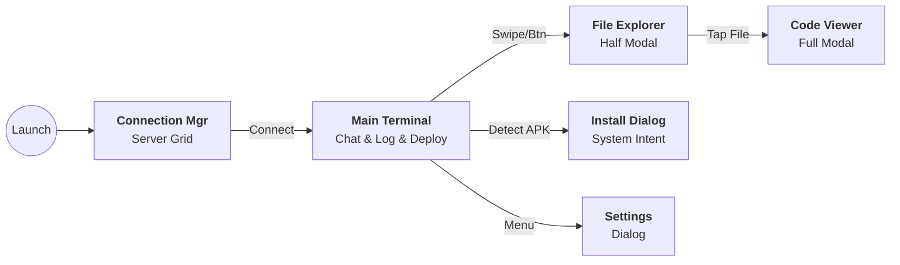

# 📱 Mobile Vibe Terminal - Master Design Document

**Project Name:** Vibe Terminal (Code Name: `vertical-vibe`)
**Version:** 2.2.0 (Explorer & Polish Complete)
**Date:** 2025-12-21
**Target Platform:** Android (Primary), Desktop/JVM (Secondary), **iOS (Future)**
**Language:** Kotlin (Kotlin Multiplatform)

## 1. プロジェクト概要 (Executive Summary)

### 1.1 コンセプト: "Vertical Vibe Coding"

スマートフォン（縦画面）での開発体験を再定義する、AI時代のSSHクライアント。
Claude Code 等の **Agentic AI** をバックエンドで動かすことを前提とし、フロントエンドは「AIへの指示(Chat)」「コード確認(View)」「動作検証(Deploy)」を、**アプリを切り替えることなくシームレスに完結させる**ことを目的とする。

### 1.2 解決する課題 (Core Problems & Solutions)

| 課題領域 | 現状の課題 | Vibe Terminal の解決策 |
| --- | --- | --- |
| **Input** | ターミナルでの1文字ずつの入力やコピペ作業が苦痛。 | **Buffered Input UI**: Gboard（グライド/音声入力）をフル活用できる入力エリアを採用。 |
| **Review** | コード確認のためにVimを開いたりアプリを切り替えると文脈が切れる。 | **Code Peek Overlay**: SSH経由でファイルを裏読みし、モーダルでサッと確認できるビューアを搭載。 |
| **Deploy** | APK転送のためにクラウドやFCMアプリを経由し、AIに余計な指示が必要。 | **Magic Trigger Deploy**: ビルド完了ログを検知し、SFTPで直接APKをDL＆インストールする機能を統合。 |
| **Vibe** | 既存アプリは事務的で、開発の気分（Vibe）が上がらない。 | **Neon Focus UI**: サイバーパンク/モダンな美学を取り入れた没入感あるUI。 |

---

## 2. システムアーキテクチャ (Technical Architecture)

Kotlin Multiplatform (KMP) を採用。共通ロジックを最大化しつつ、プラットフォーム固有機能（SSH実装、インストーラー）を抽象化して扱う。

### 2.1 技術スタック (Tech Stack)

| レイヤー | 技術/ライブラリ | 選定理由 |
| --- | --- | --- |
| **Language** | **Kotlin 2.0+** | K2コンパイラによる高速ビルドと安全性。 |
| **UI Framework** | **Compose Multiplatform** | Android/Desktop/iOSでUIコードを共有。 |
| **Navigation** | **Voyager** | KMP標準のナビゲーション。ScreenModelによるMVVMを実現。 |
| **DI** | **Koin** | アノテーション不要、DSLベースでKMP設定が容易。 |
| **Database** | **Room (KMP)** | Android/iOS/Desktop共通でSQLiteを使用。 |
| **SSH Core** | **Apache MINA** (Android/JVM)<br>

<br>**NMSSH/Libssh2** (iOS) | プラットフォームごとに最適な実装を `expect/actual` で切り替え。 |
| **Settings** | **DataStore** | キーバリュー設定の保存。 |

### 2.2 モジュール構成図

```mermaid
graph TD
    subgraph "Shared (commonMain)"
        UI[<b>UI Layer</b><br>Compose Screens<br>Voyager Nav]
        VM[<b>ScreenModel</b><br>ViewModel Logic]
        Domain[<b>Domain Layer</b><br>Interfaces (SshRepo)<br>DeployUseCase]
        Data[<b>Data Layer</b><br>Room DB<br>Settings]
    end

    subgraph "Android (androidMain)"
        Mina[<b>Apache MINA SSHD</b><br>Java Implementation]
        InstallerA[<b>Package Installer</b><br>Android API]
    end

    subgraph "iOS (iosMain - Future)"
        NativeSSH[<b>Native SSH Wrapper</b><br>Swift/C Interop]
        InstallerI[<b>AltStore / TestFlight</b><br>Manual Install Support]
    end

    UI --> VM
    VM --> Domain
    Domain --> Data
    Domain -.-> Mina
    Domain -.-> NativeSSH
    Domain -.-> InstallerA

```

---

## 3. UI/UX デザイン仕様 (Design Specifications)

**テーマ:** "Neon Focus" - 黒背景 (`#0D1117`) にネオングリーン (`#39D353`) とソフトレッド (`#FF7B72`) のアクセント。

### 3.1 画面遷移フロー



### 3.2 詳細要件

#### A. Main Terminal (The Core)

* **Log Area:** `LazyColumn(reverseLayout=true)`。ANSIカラーをComposeで描画。
* **Magic Trigger Overlay:**
* ビルド完了ログを検知した際、画面右下に「🚀 Deploy Ready」FAB (Floating Action Button) を出現させる。


* **Buffered Input:**
* 画面下部に `OutlinedTextField`。
* 「Send」ボタン押下時にのみSSHへ送信。


* **Macro Row:** キーボード上部に `ESC`, `TAB`, `CTRL+C`, `|`, `->` 等を配置。

#### B. File Explorer & Viewer

* **Explorer:** `ModalBottomSheet`。パンくずリスト（Breadcrumbs）による階層移動。
* **Viewer:** シンタックスハイライト付きのリードオンリービュー。
* SSHとは別のSFTPチャンネルで非同期にコンテンツを取得。


#### C. Connection Manager

* グリッドレイアウトのカード表示。サーバー接続情報のCRUD。

---

## 4. 機能詳細 (Logic Specification)

### 4.1 SSH通信フロー (Interface Base)

* `SshRepository` インターフェースを定義し、プラットフォームごとの実装を隠蔽する。
* **Android/Desktop:** Apache MINA SSHD を使用。
* **iOS:** 将来的に `NMSSH` や `libssh2` のKotlinラッパーを使用。


### 4.2 Native Quick Deploy

FCMや外部ストレージを使わず、SSH接続だけでデプロイを完結させる。

**フロー:**

1. **Server Side:** ビルドスクリプトが完了時に特定のマーカーを出力する。
* 例: `>> VIBE_DEPLOY: ./app/build/outputs/apk/debug/app-debug.apk`


2. **App Logic (Regex Watcher):**
* ターミナルログを常時正規表現監視: `/>> VIBE_DEPLOY: (.*\.apk)/`


3. **Trigger:**
* マッチしたら、UIに通知（FAB出現 or トースト）。


4. **Download:**
* ユーザー承認後、SFTPで対象パスのAPKをアプリ内キャッシュ領域にダウンロード。


5. **Install:**
* Android `PackageInstaller` を起動し、インストール画面を表示。
* (iOSの場合、ipaファイルの共有シートを表示する等の代替動作)


---

## 5. データベース設計 (Room)

**Table: `server_connections**`

| Column | Type | Note |
| --- | --- | --- |
| `id` | Long (PK) | Auto Increment |
| `alias` | String | 表示名 (例: My VPS) |
| `host` | String | IP address / Domain |
| `port` | Int | Default: 22 |
| `username` | String | User |
| `auth_method` | Enum | PASSWORD / KEY_PATH |
| `key_path` | String? | 秘密鍵のパス |
| `deploy_pattern` | String? | 監視するログパターン (Default: `>> VIBE_DEPLOY: (.*)`) |

---

## 6. 実装ロードマップ (Roadmap)

### Phase 1: Core Connectivity (基礎)

* [x] KMPプロジェクトセットアップ (Koin, Voyager, Room)。
* [x] **Android/JVM:** Apache MINA SSHD による接続実装。
* [x] **iOS:** スタブ実装（「iOSは将来対応です」と表示）。

### Phase 2: The "Vibe" UI (UX向上)

* [x] **Buffered Input Deck** (Gboard連携) の実装。
* [x] ANSIカラーパースの実装。
* [x] Macro Rowの実装。

### Phase 3: Magic Deploy (デプロイ機能)

* [x] ログ監視ロジック (Regex Watcher) の実装。
* [x] SFTP ダウンロード機能の実装。
* [x] Android `PackageInstaller` 連携の実装。

### Phase 4: Explorer & Polish (完成度向上) ✅ COMPLETE

* [x] File Explorer / Code Viewer の実装。
* [x] Connection Manager (DB連携) の実装。
* [x] **Technical Challenge Resolved:** Separate SSH sessions for SFTP operations.
  * Issue: SFTP and shell channels interfered when sharing the same session.
  * Solution: Implemented `withSftpSession()` helper that creates independent SSH sessions for each SFTP operation.
  * Result: Terminal and File Explorer now operate completely independently without interference.
* [x] **Performance Fix:** All SFTP operations run on `Dispatchers.IO` to prevent `NetworkOnMainThreadException` on Android.

### Phase 5: iOS Expansion (将来対応)

* [ ] iOS用 SSHライブラリ (C-Interop) の選定と実装。
* [ ] UIのiOS調整（Safe Area等）。
* [ ] iOS用デプロイフローの検討（TestFlightアップロード連携など）。

---

## 7. Phase 4 実装詳細 (Implementation Details)

### 7.1 File Explorer & Code Viewer

**実装概要:**
- `FileExplorerSheet`: `ModalBottomSheet` による階層的なファイルブラウザ
- `CodeViewerSheet`: シンタックスハイライト付きのコードビューア
- パンくずリスト (Breadcrumbs) による直感的なナビゲーション
- ファイルタイプ別アイコン表示とファイルサイズ表示

**UI コンポーネント:**
- GitHub風のダークテーマ (`#0D1117` 背景、`#39D353` アクセント)
- LazyColumn による効率的なリスト表示
- モノスペースフォントによるコード表示

### 7.2 SSH/SFTP アーキテクチャの改善

**課題と解決:**

#### 課題 1: SSH セッション共有による干渉
```
初期実装: Shell Channel と SFTP Client が同一セッションを共有
↓
問題: SFTP操作によりShellチャネルが破壊され、ターミナルコマンドが実行不能に
```

**解決策: 独立したセッション管理**
```kotlin
private suspend fun <T> withSftpSession(block: suspend (SftpClient) -> T): T =
    withContext(Dispatchers.IO) {
        // 1. 新しいSSH接続を確立
        val sftpSshClient = SshClient.setUpDefaultClient()
        sftpSshClient.start()

        // 2. 認証して専用セッションを作成
        val sftpSession = sftpSshClient.connect(username, host, port)
            .verify(10, TimeUnit.SECONDS).session
        sftpSession.addPasswordIdentity(password)
        sftpSession.auth().verify(10, TimeUnit.SECONDS)

        // 3. SFTP操作を実行
        val sftpClient = SftpClientFactory.instance().createSftpClient(sftpSession)
        try {
            return@withContext block(sftpClient)
        } finally {
            // 4. リソースをクリーンアップ
            sftpClient.close()
            sftpSession.close()
            sftpSshClient.stop()
        }
    }
```

**利点:**
- Shellセッションは完全に保護される
- SFTP操作がターミナルに一切影響しない
- 各操作後に適切にリソースが解放される

#### 課題 2: NetworkOnMainThreadException
```
問題: Android StrictMode により、メインスレッドでの
      ネットワーク操作が禁止されている
```

**解決策: Dispatchers.IO の使用**
- `withContext(Dispatchers.IO)` で全SFTP操作をバックグラウンドスレッドで実行
- UIスレッドをブロックせず、レスポンシブな操作感を維持

### 7.3 Connection Manager

**実装内容:**
- Room Database による接続設定の永続化
- グリッドレイアウトによるサーバーカード表示
- CRUD操作 (作成・読み取り・更新・削除)
- 接続履歴の管理

**データモデル:**
```kotlin
@Entity(tableName = "server_connections")
data class ServerConnection(
    @PrimaryKey(autoGenerate = true) val id: Long = 0,
    val alias: String,
    val host: String,
    val port: Int = 22,
    val username: String,
    val password: String
)
```

### 7.4 コミット履歴

Phase 4 完成までの主要コミット:

1. `bad220f` - fix: share SSH repository instance between Terminal and File Explorer
2. `3b1118e` - fix: use separate SSH sessions for SFTP to prevent shell interference
3. `e557ebb` - fix: run SFTP operations on IO dispatcher to prevent NetworkOnMainThreadException

---
