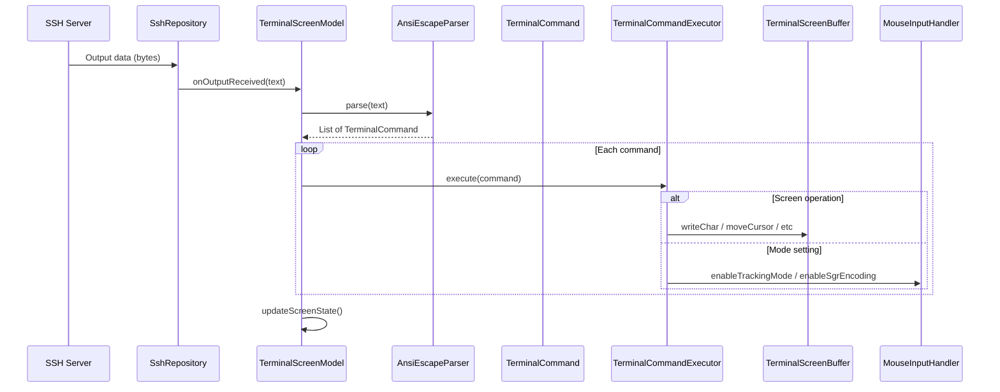
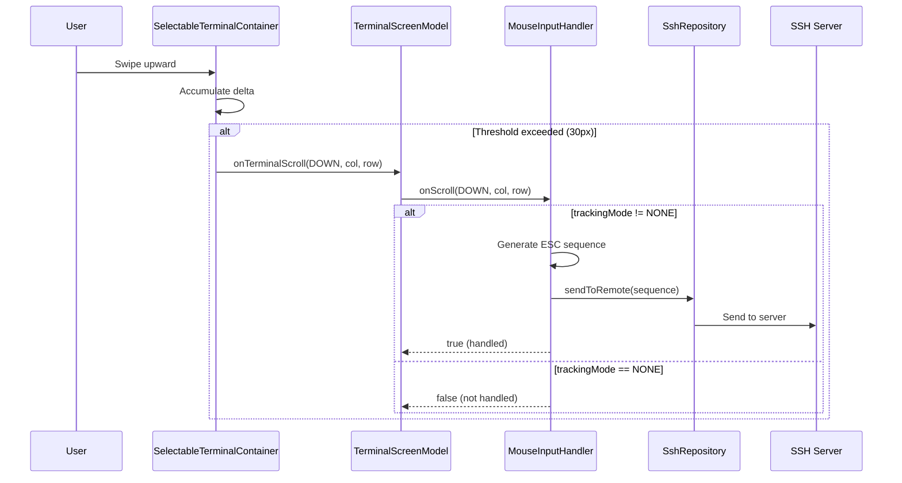
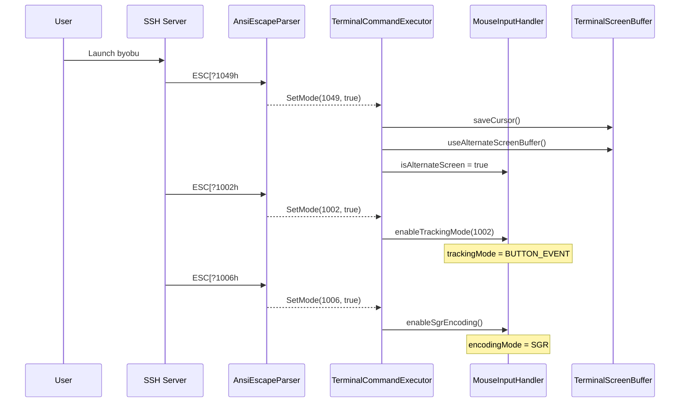
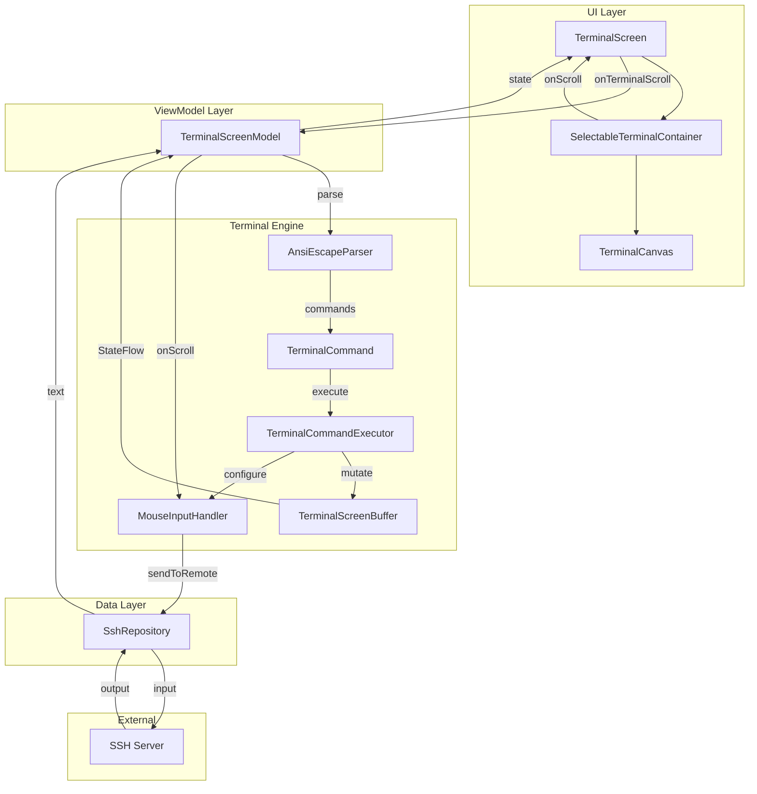

# Scrollback Buffer & Mouse Reporting Architecture

## Overview

This document describes the architecture for implementing scrollback buffer and mouse reporting features in Mobile Vibe Terminal. The implementation is divided into phases, with Phase 1 focusing on byobu/tmux compatibility.

## Current Architecture (After Phase 1 Refactoring)

### Component Overview

```
┌─────────────────────────────────────────────────────────────────────────────┐
│                              Terminal Engine                                 │
│                                                                              │
│  ┌──────────────────┐    ┌──────────────────┐    ┌──────────────────────┐  │
│  │ AnsiEscapeParser │───→│ TerminalCommand  │───→│TerminalCommandExecutor│ │
│  │   (Parse Only)   │    │  (Sealed Class)  │    │   (Execute Only)     │  │
│  └──────────────────┘    └──────────────────┘    └──────────┬───────────┘  │
│                                                              │              │
│                          ┌───────────────────────────────────┼──────────┐   │
│                          │                                   ↓          │   │
│                          │  ┌──────────────────────┐  ┌─────────────┐  │   │
│                          │  │ TerminalScreenBuffer │  │MouseInput   │  │   │
│                          │  │  - primaryBuffer     │  │Handler      │  │   │
│                          │  │  - alternateBuffer   │  │- tracking   │  │   │
│                          │  │  - cursor state      │  │- encoding   │  │   │
│                          │  └──────────────────────┘  └─────────────┘  │   │
│                          │           Terminal State                     │   │
│                          └──────────────────────────────────────────────┘   │
└─────────────────────────────────────────────────────────────────────────────┘
```

### Data Flow

```
SSH Output (bytes)
       │
       ↓
┌──────────────────┐
│ AnsiEscapeParser │  parse(text): List<TerminalCommand>
│   (Pure Parser)  │
└────────┬─────────┘
         │
         ↓
┌──────────────────┐
│ TerminalCommand  │  Sealed class with 25+ command types
│  (Data Objects)  │  - WriteChar, MoveCursor, SetMode, etc.
└────────┬─────────┘
         │
         ↓
┌──────────────────────┐
│TerminalCommandExecutor│  executeAll(commands)
│   (State Mutator)     │
└────────┬─────────────┘
         │
    ┌────┴────┐
    ↓         ↓
┌────────┐ ┌────────────┐
│Screen  │ │MouseInput  │
│Buffer  │ │Handler     │
└────────┘ └────────────┘
```

### Design Principles

| Principle | Implementation |
|-----------|----------------|
| Single Responsibility | Parser only parses, Executor only executes |
| Testability | Parser can be tested without mocking terminal state |
| Extensibility | New commands added via sealed class variants |
| Debuggability | Commands can be logged/inspected before execution |

## TerminalCommand Types

### Complete Command List

```kotlin
sealed class TerminalCommand {
    // Character Output
    data class WriteChar(val char: Char)

    // Cursor Movement
    data class MoveCursor(val row: Int, val col: Int)
    data class MoveCursorRelative(val deltaRow: Int, val deltaCol: Int)
    data class MoveCursorToColumn(val col: Int)
    data class MoveCursorToRow(val row: Int)
    data object LineFeed
    data object NextLine           // ESC E (CR + LF)
    data object CarriageReturn
    data object ReverseIndex
    data object Tab

    // Cursor Save/Restore
    data object SaveCursor
    data object RestoreCursor

    // Erase Operations
    data class EraseInDisplay(val mode: Int)
    data class EraseInLine(val mode: Int)
    data class EraseCharacters(val count: Int)

    // Line Operations
    data class InsertLines(val count: Int)
    data class DeleteLines(val count: Int)
    data class InsertCharacters(val count: Int)
    data class DeleteCharacters(val count: Int)

    // Scroll Operations
    data class ScrollUp(val lines: Int)
    data class ScrollDown(val lines: Int)
    data class SetScrollRegion(val top: Int, val bottom: Int)
    data object ResetScrollRegion

    // Attributes
    data class SetGraphicsMode(val params: List<Int>)
    data class SetCharset(val index: Int, val charset: TerminalCharset)

    // Mode Settings (DECSET/DECRST)
    data class SetMode(val mode: Int, val enabled: Boolean)
    data class SetModes(val modes: List<Int>, val enabled: Boolean)

    // Other
    data object Bell
    data object Noop
}
```

## Mouse Reporting Implementation

### MouseInputHandler

Responsibilities:
- Track current mouse reporting mode
- Convert UI touch/scroll events to terminal escape sequences
- Decide whether to send events to remote or handle locally

```kotlin
class MouseInputHandler(
    private val sendToRemote: (String) -> Unit
) {
    var trackingMode: MouseTrackingMode = MouseTrackingMode.NONE
    var encodingMode: MouseEncodingMode = MouseEncodingMode.NORMAL
    var isAlternateScreen: Boolean = false

    fun onScroll(direction: ScrollDirection, col: Int, row: Int): Boolean {
        if (trackingMode == MouseTrackingMode.NONE) return false

        val buttonCode = when (direction) {
            ScrollDirection.UP -> 64
            ScrollDirection.DOWN -> 65
        }
        sendMouseEvent(buttonCode, col, row, pressed = true)
        return true
    }

    private fun sendMouseEvent(buttonCode: Int, col: Int, row: Int, pressed: Boolean) {
        val sequence = when (encodingMode) {
            MouseEncodingMode.SGR -> {
                val suffix = if (pressed) "M" else "m"
                "\u001b[<$buttonCode;$col;$row$suffix"
            }
            MouseEncodingMode.NORMAL -> {
                val cb = (buttonCode + 32).toChar()
                val cx = (col + 32).coerceAtMost(255).toChar()
                val cy = (row + 32).coerceAtMost(255).toChar()
                "\u001b[M$cb$cx$cy"
            }
        }
        sendToRemote(sequence)
    }
}
```

### Mode Execution in TerminalCommandExecutor

```kotlin
private fun handleSetMode(mode: Int, enabled: Boolean) {
    when (mode) {
        25 -> screenBuffer.setCursorVisible(enabled)

        1000, 1002, 1003 -> {
            if (enabled) mouseInputHandler?.enableTrackingMode(mode)
            else mouseInputHandler?.disableTrackingMode(mode)
        }

        1006 -> {
            if (enabled) mouseInputHandler?.enableSgrEncoding()
            else mouseInputHandler?.disableSgrEncoding()
        }

        1049 -> {
            if (enabled) {
                screenBuffer.saveCursor()
                screenBuffer.useAlternateScreenBuffer()
                mouseInputHandler?.isAlternateScreen = true
            } else {
                screenBuffer.usePrimaryScreenBuffer()
                screenBuffer.restoreCursor()
                mouseInputHandler?.isAlternateScreen = false
            }
        }
    }
}
```

## Sequence Diagrams

### Command Processing from Terminal



### User Swipe Gesture



### Mouse Tracking Enablement (byobu startup)



## Class Relationships



## File Structure

### Phase 1 Implementation (Completed)

```
mobile-vibe-terminal/src/commonMain/kotlin/tokyo/isseikuzumaki/vibeterminal/
├── terminal/
│   ├── AnsiEscapeParser.kt        # Pure parser returning List<TerminalCommand>
│   ├── TerminalCommand.kt         # Sealed class with 25+ command types
│   ├── TerminalCommandExecutor.kt # Executes commands on terminal state
│   ├── TerminalScreenBuffer.kt    # Screen buffer management
│   ├── MouseInputHandler.kt       # Mouse event handling
│   └── MouseReportingMode.kt      # Enum definitions
├── ui/components/selection/
│   └── SelectableTerminalContainer.kt  # Scroll gesture detection
└── viewmodel/
    └── TerminalScreenModel.kt     # Wires components together
```

## Phase 2: Scrollback Buffer (Future)

### Overview

Phase 2 will add scrollback buffer support for the primary screen, allowing users to scroll back through command history when not in alternate screen mode.

### Planned Architecture

```kotlin
class ScrollbackBuffer(private val maxLines: Int = 10000) {
    private val lines = ArrayDeque<Array<TerminalCell>>()

    fun addLine(line: Array<TerminalCell>) {
        if (lines.size >= maxLines) {
            lines.removeFirst()
        }
        lines.addLast(line.copyOf())
    }
}
```

### Phase 2 Scope

- Scrollback buffer storage
- Local scroll handling in primary screen
- Scroll position indicator UI
- Memory management for large histories

## Background: Mouse Reporting Technology

### SGR Extended Mouse Mode (1006)

SGR mode is the modern standard for terminal mouse reporting:

```
Legacy:  ESC [ M Cb Cx Cy        (binary, limited to 223 columns)
SGR:     ESC [ < Cb ; Cx ; Cy M  (decimal, unlimited)
```

**Advantages:**
- No coordinate limits
- UTF-8 safe
- Explicit press (`M`) vs release (`m`)
- Clean CSI format

### Mouse Tracking Modes

| Mode | DECSET | Events Reported |
|------|--------|-----------------|
| Normal | 1000 | Press + Release |
| Button Event | 1002 | + Drag motion |
| Any Event | 1003 | + All motion |

### Communication Flow

Mouse mode negotiation is **command-based, not query-based**:

1. Server sends `ESC[?1002h` (enable button tracking)
2. Server sends `ESC[?1006h` (enable SGR encoding)
3. Terminal silently enables modes
4. User scrolls → Terminal sends `ESC[<65;col;rowM`
5. Server processes and updates screen

## Appendix: Escape Sequences

### Enable/Disable Modes

| Sequence | Description |
|----------|-------------|
| `ESC[?1000h/l` | Normal mouse tracking |
| `ESC[?1002h/l` | Button event tracking |
| `ESC[?1003h/l` | Any event tracking |
| `ESC[?1006h/l` | SGR extended mode |
| `ESC[?1049h/l` | Alternate screen buffer |

### SGR Mouse Event Format

```
ESC [ < Cb ; Cx ; Cy M   (button press)
ESC [ < Cb ; Cx ; Cy m   (button release)

Cb = button code
  0   = left button
  1   = middle button
  2   = right button
  64  = scroll up
  65  = scroll down
  +4  = shift held
  +8  = meta/alt held
  +16 = control held

Cx = column (1-based)
Cy = row (1-based)
```
