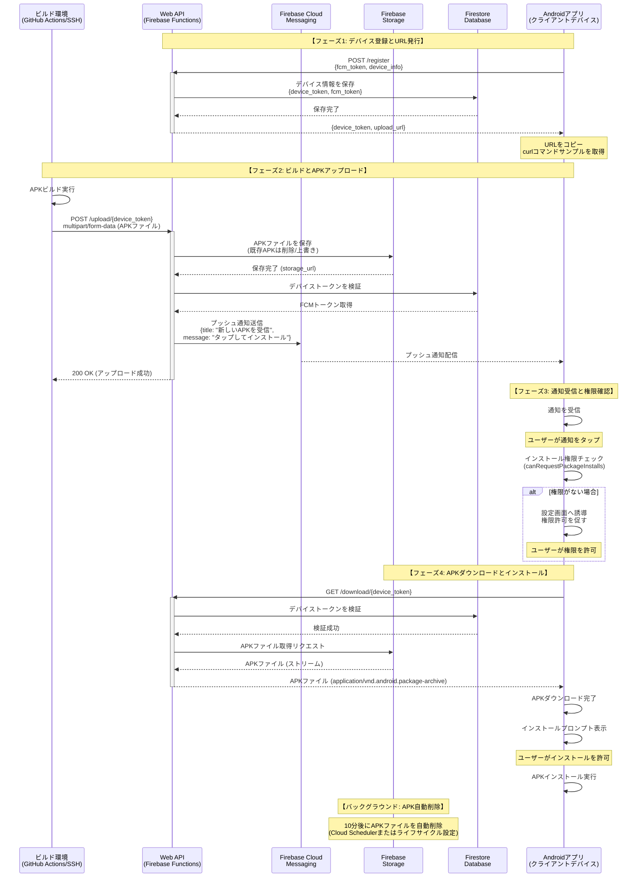

# Quick Deploy システムシーケンス図

このドキュメントは、Quick Deployシステムにおけるサーバー、システム、クライアントデバイス間の通信内容を示すシーケンス図を提供します。

## 概要

Quick Deployシステムは以下の3つの主要コンポーネント間で通信を行います：

1. **Androidアプリ (クライアントデバイス)** - スマートフォン/タブレット上で動作
2. **Web API (サーバー)** - Firebase Functions上で動作するバックエンド
3. **ビルド環境** - GitHub ActionsやSSHサーバーなどのリモートビルド環境

## 全体フローシーケンス図

## 詳細フロー説明

### フェーズ1: デバイス登録とURL発行 (C-001, A-001)

1. Androidアプリがアプリ起動時にWeb APIに登録リクエストを送信
2. Web APIは一意かつ推測困難な`device_token`を生成
3. FCMトークンとデバイス情報をFirestoreに保存
4. アップロード用URLをクライアントに返却
5. クライアントはURLとcurlコマンドサンプルを表示

**セキュリティ:**
- `device_token`はGoogle Driveの共有URLのような長く推測困難な文字列
- 新しいURL発行時、古いURLは無効化される

### フェーズ2: ビルドとAPKアップロード (A-002, A-003, A-004)

1. ビルド環境（GitHub Actionsなど）でAPKビルドが完了
2. ビルドスクリプトがcurlコマンドでAPKをアップロード
3. Web APIはAPKをFirebase Storageに保存（既存APKは削除/上書き）
4. Firestoreから対応するFCMトークンを取得
5. Firebase Cloud Messagingでプッシュ通知を送信
6. ビルド環境に成功レスポンスを返却

**タイミング:**
- APKは最新のもののみ保持（古いAPKは即時削除）
- APKは10分後に自動削除される

### フェーズ3: 通知受信と権限確認 (C-002, C-005)

1. Androidアプリがプッシュ通知を受信
2. ユーザーが通知をタップ
3. アプリがインストール権限（canRequestPackageInstalls）を確認
4. 権限がない場合、設定画面へ誘導

**ユーザー操作:**
- 初回のみ「提供元不明のアプリ」インストール権限の許可が必要

### フェーズ4: APKダウンロードとインストール (C-003, C-004)

1. Androidアプリがダウンロードエンドポイントにリクエスト
2. Web APIがデバイストークンを検証
3. Firebase StorageからAPKファイルを取得
4. APKファイルをクライアントに送信
5. クライアントがダウンロード完了後、インストールプロンプトを表示
6. ユーザーがインストールを許可

**目標性能:**
- ビルド完了からインストールプロンプト表示まで10秒以内

## エンドポイント仕様

### POST /register
- **リクエスト:** `{fcm_token: string, device_info: object}`
- **レスポンス:** `{device_token: string, upload_url: string}`
- **機能:** デバイス登録とURL発行 (A-001)

### POST /upload/{device_token}
- **リクエスト:** multipart/form-data (APKファイル)
- **レスポンス:** `{status: "success", message: string}`
- **機能:** APKアップロードとプッシュ通知送信 (A-002, A-003, A-004)

### GET /download/{device_token}
- **リクエスト:** クエリパラメータなし
- **レスポンス:** APKファイル (application/vnd.android.package-archive)
- **機能:** APKダウンロード (A-005)

## セキュリティとプライバシー

- すべての通信はHTTPSで暗号化
- `device_token`は推測困難な長い文字列（UUID v4など）
- APKファイルは一時的にのみ保存（10分後に自動削除）
- 個人利用を前提とし、複雑な認証機構は不要

## 非機能要件

| 項目 | 要件 | 対応 |
|------|------|------|
| リアルタイム性 | ビルド完了から10秒以内にインストールプロンプト表示 | FCMプッシュ通知による即時通知 |
| 簡潔性（ビルド側） | curlコマンド1行で送信可能 | POST /upload/{device_token}エンドポイント |
| 簡潔性（クライアント側） | 通知タップ→インストール許可の2操作のみ | 自動ダウンロードとプロンプト表示 |
| セキュリティ | HTTPS暗号化、推測困難なトークン | すべての通信でHTTPS、長いdevice_token |
| プラットフォーム | Android 10.0 (API 29)以上 | Android標準APIとFirebase SDK使用 |

## 参考

- [REQUIREMENTS.md](../../REQUIREMENTS.md) - 詳細な要件定義
- Firebase Cloud Messaging (FCM) - プッシュ通知
- Firebase Storage - APKファイルの一時保存
- Firestore - デバイス情報とトークンの管理
